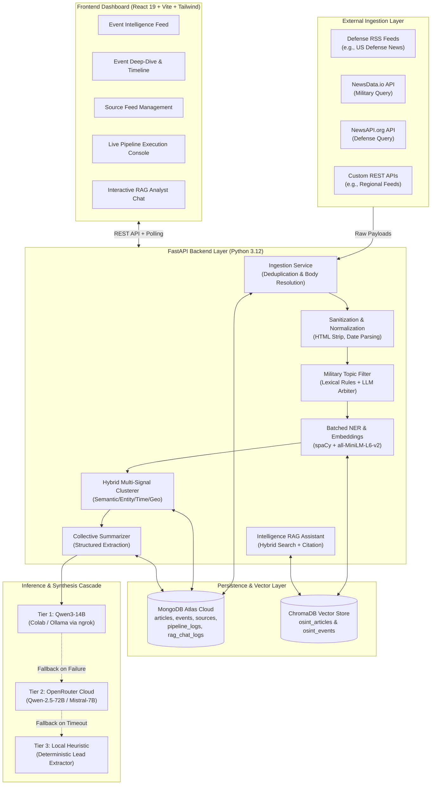

# OSINT-EIP: AI-Based Military OSINT Event Intelligence Platform
## Complete Master Architecture, Engineering & Operational Specification

---

## 1. Executive Summary & Core Principles

The **Open Source Intelligence Event Intelligence Platform (OSINT-EIP)** is an automated, real-time intelligence gathering and synthesis system engineered specifically for defense, geopolitical, and security analysis. 

The platform continuously or on-demand monitors defense news feeds (RSS and structured REST APIs), validates content against a strict military domain filter, extracts named entities (locations, organizations, military assets, dates), projects content into a high-dimensional semantic space, clusters disparate reports into unified real-world geopolitical events using a hybrid multi-signal scoring model, and generates structured collective intelligence summaries through a three-tier LLM cascade.

```
┌──────────────────────────────────────────────────────────────────────────────────────────────────┐
│                                     CORE ARCHITECTURAL LAWS                                      │
├──────────────────────────────────────────────────────────────────────────────────────────────────┤
│ 1. Zero Authentication: Fully public dashboard and APIs. No auth, sessions, cookies, or JWTs.    │
│ 2. Cloud-Native Storage: MongoDB Atlas cloud cluster via MONGODB_URI (no local MongoDB).         │
│ 3. Deterministic Pipeline: Triggered manually via POST /api/pipeline/run (no background cron).  │
│ 4. Total Reset Cycle: Every pipeline execution wipes all DB collections except `sources`.        │
│ 5. Strict Military Filter: Non-military noise rejected before vectorization and clustering.      │
│ 6. Hybrid Clustering: Multi-signal similarity (Semantic + Entity + Time + Location + Source).    │
│ 7. Collective Synthesis: Summaries generated across ALL member articles of an event combined.   │
│ 8. 3-Tier LLM Resilience: Qwen3-14B Tunnel → OpenRouter Cloud → Deterministic Local Fallback.    │
│ 9. Real-Time Observability: Every phase emits structured JSON metrics to DB and SSE/polling.     │
└──────────────────────────────────────────────────────────────────────────────────────────────────┘
```

---

## 2. High-Level System Architecture



---

## 3. Repository Directory Structure

```
c:\Users\Charan\codex_major\
├── .env                              # Active runtime environment configuration
├── .env.example                      # Reference template for environment variables
├── .gitignore                        # Git ignore specifications
├── AGENTS.md                         # Core system rules and behavioral contracts for AI agents
├── README.md                         # Quick-start documentation
├── pytest.ini                        # Pytest configuration and asyncio mode settings
│
├── backend/                          # FastAPI Backend Application
│   ├── app/
│   │   ├── __init__.py
│   │   ├── main.py                   # FastAPI app entry point, CORS, routers, lifecycle
│   │   ├── core/
│   │   │   ├── __init__.py
│   │   │   └── config.py             # Pydantic BaseSettings, env parsing, defaults
│   │   ├── db/
│   │   │   ├── __init__.py
│   │   │   ├── mongo.py              # Async Motor MongoDB Atlas client & lifecycle
│   │   │   └── chroma.py             # ChromaDB client & collection management
│   │   ├── models/
│   │   │   ├── __init__.py
│   │   │   ├── domain.py             # Domain models (Article, Event, Source, PipelineLog)
│   │   │   └── schemas.py            # API request/response Pydantic schemas
│   │   ├── repositories/
│   │   │   ├── __init__.py
│   │   │   ├── article_repository.py # MongoDB CRUD for ingested articles
│   │   │   ├── event_repository.py   # MongoDB CRUD for clustered events
│   │   │   ├── source_repository.py  # MongoDB CRUD for active/inactive sources
│   │   │   └── log_repository.py     # MongoDB CRUD for pipeline & RAG logs
│   │   ├── services/
│   │   │   ├── __init__.py
│   │   │   ├── ingestion_service.py  # RSS & REST API client, URL deduplication
│   │   │   ├── cleaning_service.py   # HTML stripping, normalization, date parsing
│   │   │   ├── topic_filter_service.py # Military keyword rules & LLM classification
│   │   │   ├── ner_embedding_service.py # spaCy NER and sentence-transformers embeddings
│   │   │   ├── clustering_service.py # Hybrid multi-signal event clustering engine
│   │   │   ├── summarization_service.py # 3-tier collective event summary generator
│   │   │   ├── rag_service.py        # Vector search and grounded QA assistant
│   │   │   └── pipeline_service.py   # Orchestrator for the 7-phase run cycle
│   │   ├── clients/
│   │   │   ├── __init__.py
│   │   │   └── llm_client.py         # Multi-tier client: Qwen tunnel -> OpenRouter -> Fallback
│   │   └── routers/
│   │       ├── __init__.py
│   │       ├── pipeline_router.py    # /api/pipeline (run, clean-db, status, logs)
│   │       ├── events_router.py      # /api/events (listing, detail, member articles)
│   │       ├── articles_router.py    # /api/articles (listing, single article view)
│   │       ├── sources_router.py     # /api/sources (CRUD for ingestion feeds)
│   │       ├── search_router.py      # /api/search (keyword + semantic hybrid search)
│   │       └── assistant_router.py   # /api/assistant/chat (RAG conversation endpoint)
│   ├── tests/                        # Comprehensive Pytest Suite
│   │   ├── test_api_read.py          # Read endpoint schema and data tests
│   │   ├── test_assistant.py         # RAG query and citation tests
│   │   ├── test_clustering.py        # Hybrid clustering math and threshold tests
│   │   ├── test_ner_embedding.py     # NER extraction and embedding dimension tests
│   │   ├── test_pipeline_control.py  # Pipeline execution, lock, and clean DB tests
│   │   ├── test_summarization.py     # LLM cascade and structured fallback tests
│   │   └── test_topic_filter.py      # Military topic inclusion/rejection tests
│   └── requirements.txt              # Backend Python dependencies
│
├── frontend/                         # React 19 Frontend Application
│   ├── index.html                    # Application entry HTML
│   ├── package.json                  # Frontend dependencies and build scripts
│   ├── vite.config.ts                # Vite config with backend proxy (/api -> :8000)
│   ├── tailwind.config.js            # Tailwind styling tokens and dark palette
│   ├── src/
│   │   ├── main.tsx                  # React DOM root mounting
│   │   ├── App.tsx                   # Top-level routing, layout shell, navigation
│   │   ├── index.css                 # Global CSS tokens, scrollbar styling, glassmorphism
│   │   ├── api/
│   │   │   └── client.ts             # Axios/fetch typed API client for all backend routes
│   │   ├── components/
│   │   │   ├── Navbar.tsx            # Top application header with live status pill
│   │   │   ├── EventCard.tsx         # Event summary card with threat badges and metrics
│   │   │   ├── FilterBar.tsx         # Threat level, region, date range filtering
│   │   │   ├── AIAssistantDrawer.tsx # Slide-out RAG analyst with source citation cards
│   │   │   └── StatusIndicator.tsx   # Visual status badge for background operations
│   │   └── pages/
│   │       ├── DashboardPage.tsx     # Main intelligence feed of clustered events
│   │       ├── EventDetailPage.tsx   # Comprehensive event breakdown, timeline, articles
│   │       ├── SourcesPage.tsx       # Live feed management (toggle, add, delete, test)
│   │       ├── PipelinePage.tsx      # Real-time execution console and historical logs
│   │       └── SearchPage.tsx        # Hybrid semantic and keyword discovery portal
│
└── docs/                             # Original Engineering & Requirements Specifications
    ├── 01-project-proposal.md        # Problem statement, scope, business goals
    ├── 02-srs.md                     # Software Requirements Specification
    ├── 03-functional-requirements.md # Detailed FR-001 through FR-010 specs
    ├── 04-non-functional-requirements.md # Latency, reliability, security constraints
    ├── 05-system-architecture.md     # Component diagrams, data flow, tech stack
    ├── 06-database-design.md         # MongoDB collection schemas and indexes
    ├── 07-api-specification.md       # REST endpoint contracts and payloads
    ├── 08-ui-ux-specification.md     # Design system, layout, interaction rules
    ├── 09-business-logic.md          # Clustering formula, filtering, fallback logic
    ├── 10-uml-diagrams.md            # Sequence, activity, state-machine diagrams
    ├── 11-testing-and-test-cases.md  # Test case matrix (TC-001 to TC-020)
    ├── 12-coding-standards.md        # Style guides, error conventions, linting rules
    └── 13-definition-of-done.md      # Acceptance criteria checklist
```

---

## 4. End-to-End Pipeline Execution (The 7 Phases)

The entire pipeline executes via `POST /api/pipeline/run`. If a pipeline is already running, the endpoint rejects the request with HTTP `409 Conflict`.

```mermaid
sequenceDiagram
    autonumber
    actor User as Analyst / UI
    participant Pipe as Pipeline Orchestrator
    participant DB as MongoDB Atlas
    participant Vector as ChromaDB
    participant Ingest as Ingestion Service
    participant Filter as Topic Filter
    participant NER as NER & Embeddings
    participant Cluster as Hybrid Clustering
    participant LLM as LLM Cascade

    User->>Pipe: POST /api/pipeline/run
    Note over Pipe: Check lock: acquire or return 409

    rect rgb(30, 41, 59)
        Note over Pipe,Vector: Phase 1: Database Clean & Reset
        Pipe->>DB: Delete articles, events, pipeline_logs (Preserve `sources`)
        Pipe->>Vector: Reset collections (osint_articles, osint_events)
    end

    rect rgb(15, 23, 42)
        Note over Pipe,Ingest: Phase 2: Multi-Source Ingestion
        Pipe->>DB: Query active sources (RSS, APIs)
        Pipe->>Ingest: Fetch all feeds concurrently
        Ingest-->>Pipe: Raw articles (deduplicated by URL SHA256)
    end

    rect rgb(30, 41, 59)
        Note over Pipe,Filter: Phase 3 & 4: Cleaning & Topic Filtering
        Pipe->>Filter: Filter military topics (Rules + LLM check)
        Filter-->>Pipe: Military-relevant articles only
    end

    rect rgb(15, 23, 42)
        Note over Pipe,NER: Phase 5: Batched NER & Semantic Vectorization
        Pipe->>NER: Extract entities (GPE, LOC, ORG, WEAPON, DATE)
        Pipe->>NER: Generate 384-d dense embeddings (all-MiniLM-L6-v2)
        Pipe->>DB: Persist filtered articles with vectors & entities
        Pipe->>Vector: Upsert embeddings into ChromaDB
    end

    rect rgb(30, 41, 59)
        Note over Pipe,Cluster: Phase 6: Hybrid Multi-Signal Clustering
        Pipe->>Cluster: Run 5-signal similarity matrix (Threshold: 0.62)
        Cluster-->>Pipe: Formed Event Clusters (Multi-article & Singletons)
    end

    rect rgb(15, 23, 42)
        Note over Pipe,LLM: Phase 7: Collective Summarization
        loop For each Event Cluster
            Pipe->>LLM: Collective synthesis prompt (All member texts)
            alt Tier 1: Qwen3-14B Tunnel
                LLM-->>Pipe: Structured JSON Summary
            else Tier 2: OpenRouter Cloud
                LLM-->>Pipe: Structured JSON Summary
            else Tier 3: Local Structured Fallback
                LLM-->>Pipe: Heuristic Structured Summary
            end
            Pipe->>DB: Save Event & update articles with event_id
            Pipe->>Vector: Upsert Event embedding
        end
    end

    Pipe-->>User: Pipeline Complete (Run metrics & logs persisted)
```



### Detailed Phase Breakdown

#### Phase 1: Clean DB
- **Action**: Completely empties `articles`, `events`, and `pipeline_logs` from MongoDB Atlas.
- **Invariance**: The `sources` collection is strictly preserved.
- **Vector Wipe**: ChromaDB collections `osint_articles` and `osint_events` are reset.

#### Phase 2: Ingestion & Deduplication
- **Concurrency**: Fetches all `active: true` sources in parallel via `httpx.AsyncClient` with a 15-second timeout and custom `User-Agent: OSINT-EIP/1.0`.
- **Feed Adapters**:
  - **RSS / Atom**: Parsed with `feedparser`.
  - **REST APIs**: Unwraps JSON dictionaries checking `results`, `articles`, `data`, or custom root mappings.
  - **Recency**: Sorts records descending by publication date before ingesting top entries.
- **Deduplication**: Calculates SHA256 of normalized URLs to prevent duplicate ingestion within a run.

#### Phase 3: Text Normalization & Cleaning
- Strips HTML markup, cleans whitespace, decodes HTML entities.
- Extracts or parses publication timestamps into normalized ISO 8601 UTC.
- Fallback: If an API returns an empty content body, the ingestion service transparently populates content from `title + "\n" + description`.

#### Phase 4: Military Topic Filter
- Evaluates whether an article pertains to military, defense, weapons, warfare, or tactical geopolitics.
- **Rule Engine**: Scans for military taxonomies (combat, defense, naval, missile, troop, radar, NATO, ceasefire, Pentagon, etc.).
- **LLM Verification**: Ambiguous or borderline articles are evaluated by the fast LLM classifier. Non-military articles (e.g. domestic politics, unrelated crime, entertainment) are marked `is_military: false` and discarded.

#### Phase 5: Batched NER & Vector Embedding
- **Named Entity Recognition (NER)**: Uses spaCy (`en_core_web_sm`) to extract `GPE` (countries/cities), `LOC` (regions/seas), `ORG` (military branches/alliances), and `DATE`.
- **Dense Embedding**: Generates 384-dimensional dense vectors using `sentence-transformers/all-MiniLM-L6-v2`. Processed in batches of 32 for optimal memory and GPU/CPU latency.
- **Vector Storage**: Article embeddings are upserted into ChromaDB collection `osint_articles` with metadata (`article_id`, `source_id`, `published_at`).

#### Phase 6: Hybrid Multi-Signal Event Clustering
Articles are grouped into real-world events using a unified multi-signal scoring function.

##### Mathematical Scoring Formulation
For any two articles $A_i$ and $A_j$, the composite compatibility score $S(A_i, A_j) \in [0, 1]$ is:

$$S(A_i, A_j) = w_{sem} \cdot S_{sem} + w_{ent} \cdot S_{ent} + w_{time} \cdot S_{time} + w_{loc} \cdot S_{loc} + w_{src} \cdot S_{src}$$

Where:
- **$S_{sem}$ (Semantic Similarity)**: Cosine similarity between dense embeddings:
  $$S_{sem} = \frac{\vec{v}_i \cdot \vec{v}_j}{\|\vec{v}_i\| \|\vec{v}_j\|}$$
- **$S_{ent}$ (Entity Jaccard Similarity)**: Overlap of extracted named entities:
  $$S_{ent} = \frac{|Entities(A_i) \cap Entities(A_j)|}{|Entities(A_i) \cup Entities(A_j)|}$$
- **$S_{time}$ (Temporal Proximity Decay)**: Exponential decay based on publication difference $\Delta t$ in hours:
  $$S_{time} = \exp\left(-\frac{\Delta t}{48}\right)$$
- **$S_{loc}$ (Geographic Match)**: Jaccard overlap of `GPE` and `LOC` entities ($1.0$ if identical, $0.0$ if completely disjoint).
- **$S_{src}$ (Cross-Source Boost)**: Encourages multi-source reporting consolidation:
  $$S_{src} = \begin{cases} 1.0 & \text{if } Source(A_i) \neq Source(A_j) \\ 0.0 & \text{if } Source(A_i) = Source(A_j) \end{cases}$$

##### Signal Weights & Thresholds
| Parameter | Symbol | Value | Operational Justification |
| :--- | :--- | :--- | :--- |
| **Semantic Weight** | $w_{sem}$ | **0.45** | Primary driver of topic and context coherence |
| **Entity Weight** | $w_{ent}$ | **0.25** | Prevents conflating different operations in similar regions |
| **Time Weight** | $w_{time}$ | **0.15** | Prevents grouping historical events with current actions |
| **Location Weight** | $w_{loc}$ | **0.10** | Rewards geographic congruence |
| **Cross-Source Weight** | $w_{src}$ | **0.05** | Promotes merging coverage from multiple news agencies |
| **Clustering Threshold** | $\theta$ | **0.62** | Rigorously tested cut-off preventing false merges |

#### Phase 7: Collective Structured Summarization
Every formed cluster is passed to the summarization pipeline:
- **Collective Input**: The titles, source names, and full body content of **all** member articles in the event are combined into a collective prompt.
- **Three-Tier Fallback Cascade**:
  1. **Tier 1 (Qwen3-14B)**: Targeted via local Colab/Ollama tunnel (`QWEN_BASE_URL`). Timeout: 7 seconds.
  2. **Tier 2 (OpenRouter)**: Cloud secondary fallback (`OPENROUTER_BASE_URL`). Timeout: 7 seconds.
  3. **Tier 3 (Structured Local Heuristic)**: Deterministic rule-based extractor that parses the lead paragraphs, extracts most frequent entities, ranks key sentences, and computes threat levels without external dependencies.
- **Output Schema**:
  ```json
  {
    "summary": "Concise 2-3 sentence strategic intelligence overview.",
    "key_events": ["Chronological event point 1", "Point 2"],
    "conflicting_reports": ["Discrepancies across reporting agencies, if any"],
    "threat_level": "LOW | MEDIUM | HIGH | CRITICAL",
    "entities": ["Extracted organizations, weapon systems, units"],
    "primary_location": "Country or theater of operations"
  }
  ```

---

## 5. Database Schema & Persistence Models

### 5.1 MongoDB Atlas Collections

#### 1. `articles` (Wiped on each run)
```json
{
  "_id": "ObjectId",
  "id": "65f2a1b9c8e1a4d2f8e12345",
  "source_id": "6ac32e7e84f0cb54d78b9554",
  "title": "Defense Ministry Announces Modernization Plan for Air Defense Network",
  "url": "https://defensenews.example.com/air-defense-modernization",
  "content": "Full cleaned text of the article...",
  "published_at": "2026-10-05T08:30:00Z",
  "fetched_at": "2026-10-05T09:00:15Z",
  "entities": {
    "gpe": ["Poland", "Germany"],
    "loc": ["Baltic Sea"],
    "org": ["NATO", "Ministry of National Defence"],
    "weapon": ["Patriot System", "NASAMS"]
  },
  "is_military": true,
  "confidence_score": 0.94,
  "event_id": "65f2a201c8e1a4d2f8e12399"
}
```

#### 2. `events` (Wiped on each run)
```json
{
  "_id": "ObjectId",
  "id": "65f2a201c8e1a4d2f8e12399",
  "title": "NATO Eastern Flank Air Defense Modernization",
  "summary": "Poland and regional allies have initiated integrated procurement of next-generation missile defense batteries.",
  "threat_level": "MEDIUM",
  "primary_location": "Poland",
  "entities": ["NATO", "Ministry of National Defence", "Patriot System"],
  "article_ids": [
    "65f2a1b9c8e1a4d2f8e12345",
    "65f2a1b9c8e1a4d2f8e12346"
  ],
  "sources": ["NewsAPI.org Military", "US Defense News RSS"],
  "first_seen": "2026-10-05T08:30:00Z",
  "last_updated": "2026-10-05T09:15:00Z",
  "key_events": [
    "Formal announcement delivered in Warsaw.",
    "Bilateral logistics coordination established with allied command."
  ],
  "conflicting_reports": [],
  "summary_source": "qwen3-14b"
}
```

#### 3. `sources` (Preserved permanently across runs)
```json
{
  "_id": "ObjectId",
  "id": "6ac32e7e84f0cb54d78b9554",
  "name": "NewsAPI.org Military",
  "type": "api",
  "url": "https://newsapi.org/v2/everything?q=military%20defense&language=en&sortBy=publishedAt&pageSize=25&apiKey=...",
  "trust_rating": 80,
  "active": true,
  "field_mapping": {
    "root": "articles",
    "title": "title",
    "url": "url",
    "content": "description",
    "published_at": "publishedAt"
  }
}
```

#### 4. `pipeline_logs` (Appended per phase, wiped on reset)
```json
{
  "_id": "ObjectId",
  "run_id": "run_20261005_091522",
  "phase": "clustering",
  "status": "completed",
  "timestamp": "2026-10-05T09:16:04Z",
  "items_in": 35,
  "items_out": 8,
  "errors": [],
  "duration_seconds": 1.42
}
```

#### 5. `rag_chat_logs` (Audit of user interactions)
```json
{
  "_id": "ObjectId",
  "timestamp": "2026-10-05T09:25:00Z",
  "query": "What systems were announced for Baltic air defense?",
  "response": "Poland and NATO announced deployment of Patriot and NASAMS batteries [Article: Defense Ministry Announces Modernization Plan].",
  "sources_cited": ["65f2a1b9c8e1a4d2f8e12345"],
  "latency_ms": 840
}
```

### 5.2 ChromaDB Collections

1. **`osint_articles`**:
   - Vector: 384-dimensional dense representation (`all-MiniLM-L6-v2`) of `title + " " + content[:1000]`.
   - Metadata: `article_id`, `source_id`, `published_at`, `is_military`.
2. **`osint_events`**:
   - Vector: 384-dimensional dense representation of `title + " " + summary`.
   - Metadata: `event_id`, `threat_level`, `primary_location`, `article_count`.

---

## 6. Complete REST API Specifications

All endpoints are public and require no authentication header.

### 6.1 Pipeline Execution & Status
| Method | Endpoint | Description | Status Codes |
| :--- | :--- | :--- | :--- |
| `POST` | `/api/pipeline/run` | Triggers the complete 7-phase ingestion and intelligence cycle | 200, 409 (if running) |
| `POST` | `/api/pipeline/clean-db` | Standalone reset that wipes DB & ChromaDB (preserves sources) | 200, 409 (if running) |
| `GET` | `/api/pipeline/status` | Returns active running status, current phase, and phase metrics | 200 |
| `GET` | `/api/pipeline/logs` | Historical execution logs grouped by `run_id` | 200 |

### 6.2 Intelligence Events
| Method | Endpoint | Query Parameters | Description |
| :--- | :--- | :--- | :--- |
| `GET` | `/api/events` | `limit`, `skip`, `threat_level`, `location`, `sort` | Paginated listing of clustered events |
| `GET` | `/api/events/{id}` | - | Detailed breakdown of an event including collective summary |
| `GET` | `/api/events/{id}/articles` | - | Full list of all raw member articles clustered under this event |

### 6.3 Raw Articles
| Method | Endpoint | Query Parameters | Description |
| :--- | :--- | :--- | :--- |
| `GET` | `/api/articles` | `limit`, `skip`, `source_id`, `is_military` | Raw ingested articles |
| `GET` | `/api/articles/{id}` | - | Single article metadata and extracted entities |

### 6.4 Source Feed Management
| Method | Endpoint | Payload / Params | Description |
| :--- | :--- | :--- | :--- |
| `GET` | `/api/sources` | - | Returns all registered RSS and API news sources |
| `POST` | `/api/sources` | `{ name, type, url, trust_rating, active, field_mapping }` | Adds a new feed to the platform |
| `PUT` | `/api/sources/{id}` | Partial source object | Toggles active state or edits configuration |
| `DELETE` | `/api/sources/{id}` | - | Permanently deletes a news feed |

### 6.5 Hybrid Search & RAG Assistant
| Method | Endpoint | Payload / Query | Description |
| :--- | :--- | :--- | :--- |
| `GET` | `/api/search` | `?q=...&semantic=true&limit=20` | Dual-mode keyword and cosine vector search |
| `POST` | `/api/assistant/chat` | `{ "query": "..." }` | Grounded RAG intelligence analyst with explicit citations |

---

## 7. Frontend User Experience & Design System

The frontend is built with **React 19**, **Vite**, and **Tailwind CSS**, designed according to a sleek, tactical **Dark Theme OSINT Intelligence Aesthetic**.

```
┌──────────────────────────────────────────────────────────────────────────────────────────────────┐
│                                   TACTICAL UI COLOR TOKENS                                       │
├──────────────────────────────────────────────────────────────────────────────────────────────────┤
│ Background Canvas:     #0A0F1D (Deep Midnight Slate)                                             │
│ Surface / Cards:       #111827 / #1E293B (Layered Slate with 1px border #334155)                 │
│ Tactical Accent:       #38BDF8 (Cyan 400 - Radars, Active States, Data Pointers)                 │
│ Critical Threat:       #EF4444 (Red 500 - Combat Operations, Ballistic Launches, High Threat)    │
│ High Threat:           #F97316 (Orange 500 - Major Military Exercises, Border Tensions)          │
│ Medium Threat:         #FACC15 (Amber 400 - Procurement Deals, Logistics Shifts)                 │
│ Low / Info Threat:     #10B981 (Emerald 500 - Routine Bilateral Discussions, Peace Accords)      │
│ Font Family:           Inter, SF Pro Display, JetBrains Mono (for raw feeds & telemetry)         │
└──────────────────────────────────────────────────────────────────────────────────────────────────┘
```

### View Descriptions
1. **Dashboard Page (`/`)**:
   - Real-time KPI stat cards: Total Monitored Events, Ingested Articles, High Threat Alerts, Active Sources.
   - Live Intelligence Feed displaying consolidated event cards with threat badges, source chips, and timestamps.
   - Quick filters for threat severity, theater of operations, and recency.
2. **Event Deep-Dive (`/events/:id`)**:
   - Collective structured intelligence brief (Executive Summary, Key Events, Conflicting Reports).
   - Interactive Member Article explorer displaying original headlines, dates, trust ratings, and direct source links.
   - Extracted Entity matrix (GPE, LOC, ORG, WEAPONS).
3. **Pipeline Control Center (`/pipeline`)**:
   - Single-click **"Run Pipeline"** and **"Clean DB"** execution controls.
   - Live execution telemetry showing real-time phase progression with items-in, items-out, and latency metrics.
   - Historical audit log table.
4. **Sources Management (`/sources`)**:
   - Status toggles for each source (RSS / API).
   - Form for registering new sources with custom JSON field mappings.
5. **Interactive RAG Intelligence Drawer**:
   - Accessible globally from any screen via the top navigation bar.
   - Grounded conversational interface capable of answering cross-event synthesis questions with clickable source references `[Article: ...]`.

---

## 8. Configuration Reference (.env)

| Environment Variable | Description | Production Default |
| :--- | :--- | :--- |
| `MONGODB_URI` | MongoDB Atlas Cloud Connection String | `mongodb+srv://<user>:<pwd>@cluster.mongodb.net/osint_eip?retryWrites=true&w=majority` |
| `CHROMADB_PATH` | Directory for persistent local vector embeddings | `./chroma_data` |
| `QWEN_BASE_URL` | Endpoint for primary Qwen3-14B LLM tunnel | `http://localhost:11434/v1` or ngrok URL |
| `QWEN_API_KEY` | Bearer token for Qwen tunnel | `ollama` or tunnel key |
| `QWEN_MODEL` | Primary model identifier | `qwen3-14b` |
| `QWEN_TIMEOUT_SECONDS` | Maximum wait time before falling back to OpenRouter | `7` |
| `OPENROUTER_BASE_URL` | Cloud OpenRouter API URL | `https://openrouter.ai/api/v1` |
| `OPENROUTER_API_KEY` | Secondary fallback API key | `sk-or-v1-...` |
| `OPENROUTER_MODEL` | Secondary model identifier | `qwen/qwen-2.5-72b-instruct` |
| `OPENROUTER_TIMEOUT_SECONDS` | Maximum wait time before triggering local fallback | `7` |
| `SOURCE_REQUEST_TIMEOUT_SECONDS`| Maximum wait time for single external feed ingestion | `15` |
| `HYBRID_MATCH_THRESHOLD` | Mathematical threshold for event cluster membership | `0.62` |

---

## 9. Verification & Testing Framework

The platform includes a 23-test unit and integration test suite executing under `pytest`.

```bash
# Execute entire test suite
pytest backend/tests/ -v
```

### Test Suite Matrix
- `test_api_read.py`: Validates all REST endpoints against OpenAPI response schemas and empty-state scenarios.
- `test_clustering.py`: Verifies the 5-signal hybrid clustering engine, ensuring identical articles merge into an event while disparate topics stay distinct.
- `test_ner_embedding.py`: Validates entity extraction (spaCy) and 384-dimensional vector embedding generation.
- `test_topic_filter.py`: Asserts that non-military noise is rejected and defense articles are preserved.
- `test_summarization.py`: Tests the 3-tier cascade, validating primary tunnel calls, OpenRouter transitions, and structured local fallback output.
- `test_assistant.py`: Asserts that RAG search retrieves relevant context and formats source citations properly.
- `test_pipeline_control.py`: Validates the pipeline lock (`409 Conflict` on concurrent requests) and database wipe behavior.

---

## 10. Operations & Developer Runbook

### 10.1 Initial Setup

#### 1. Clone & Environment Configuration
```bash
git clone https://github.com/Charanraju360/military-v2.git
cd military-v2

# Configure environment variables
cp .env.example .env
# Edit .env with your MongoDB Atlas URI, OpenRouter key, and Qwen endpoint
```

#### 2. Backend Installation
```bash
cd backend
python -m venv venv
venv\Scripts\activate   # On Windows
pip install -r requirements.txt
python -m spacy download en_core_web_sm
```

#### 3. Frontend Installation
```bash
cd ../frontend
npm install
```

---

### 10.2 Starting the Platform Locally

#### 1. Start FastAPI Backend Server
```bash
cd backend
python -m uvicorn app.main:app --host 127.0.0.1 --port 8000 --reload
```
*Backend Swagger UI will be available at:* **`http://127.0.0.1:8000/docs`**

#### 2. Start Vite Frontend Server
```bash
cd frontend
npm run dev
```
*Frontend Application will be available at:* **`http://localhost:5173/`**

---

### 10.3 Setting up Primary Qwen3-14B via Google Colab / Ollama

To run Tier 1 summarization locally or via Colab:
1. In Colab, launch an Ollama instance:
   ```bash
   !curl -fsSL https://ollama.com/install.sh | sh
   !ollama serve &
   !ollama pull qwen3:14b
   ```
2. Expose the port via `ngrok` or `localtunnel`:
   ```bash
   !pip install pyngrok
   from pyngrok import ngrok
   tunnel = ngrok.connect(11434)
   print("Public URL:", tunnel.public_url)
   ```
3. Copy the public URL into `.env`:
   ```env
   QWEN_BASE_URL=https://<your-ngrok-id>.ngrok-free.app/v1
   QWEN_MODEL=qwen3:14b
   ```

If the Colab tunnel disconnects or times out beyond 7 seconds, the backend automatically transitions to OpenRouter, and if OpenRouter is unreachable, executes the structured local fallback.

---

### 10.4 Triggering an Intelligence Run

1. Open **`http://localhost:5173/pipeline`** in your browser.
2. Click **Run Pipeline**.
3. Watch the real-time execution console as it completes the 7 phases:
   - Ingests Defense News RSS, NewsData.io, NewsAPI.org, and custom APIs.
   - Normalizes and filters to military events.
   - Extracts named entities and vectors.
   - Consolidates cross-source reports into events.
   - Generates collective structured summaries.
4. Navigate to **`http://localhost:5173/`** to explore the intelligence dashboard or open the **AI Assistant** to query the updated knowledge base.

---
*Generated for OSINT-EIP System Documentation. All rights reserved.*
