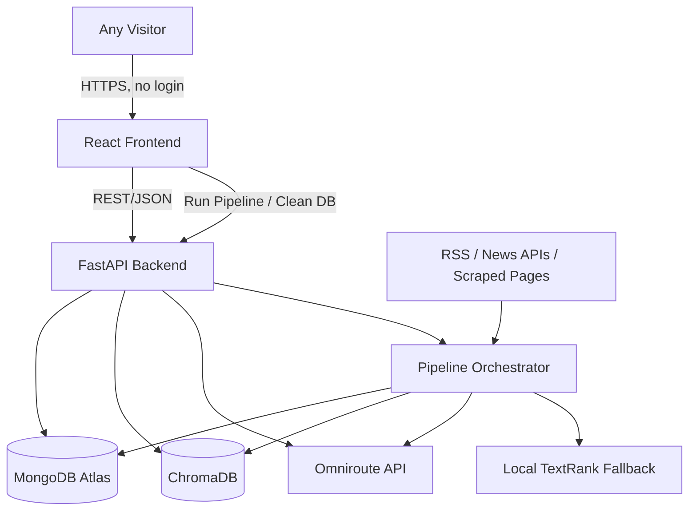

# System Architecture Document

## 1. Architecture Overview
Modular monolith, no auth layer. One FastAPI backend (manual pipeline control + REST API) backed by MongoDB Atlas (cloud) and ChromaDB (local vector store), serving a public React frontend. No scheduler process — pipeline runs only on explicit trigger.

## 2. Technology Stack

| Layer | Technology | Role |
|---|---|---|
| Frontend | React + Tailwind | Public dashboard, search, assistant, pipeline control panel |
| Backend | FastAPI (Python 3.11+) | REST API, pipeline orchestration |
| Primary DB | MongoDB Atlas (cloud) | via `MONGODB_URI` connection string |
| Vector store | ChromaDB | Embeddings for clustering + semantic search + RAG |
| Embedding model | BGE/E5-family (batch-capable) | Vector generation |
| Clustering | UMAP + HDBSCAN | Meaning-only event grouping |
| NER | spaCy / GLiNER (batch-capable) | Entity extraction |
| HTML parsing | Beautiful Soup | RSS and configured scrape-source extraction, including CSS selectors |
| Summarization/RAG | Omniroute (primary) → TextRank (local fallback, summarization only) | Event summaries, assistant answers |
| Auth | **None** | Public access to everything |

## 3. High-Level Architecture Diagram



## 4. Frontend Architecture
- React + Tailwind, React Query for server state, no auth context needed (no login).
- **Pages**: Event Feed (home, public), Event Detail, Search, Assistant Chat, Sources config, Pipeline Control (Run / Clean DB / live phase status / past logs).
- All routes public — no protected-route logic.

## 5. Backend Architecture
- **Routers**: `events.py`, `search.py`, `assistant.py`, `sources.py`, `pipeline.py` — no `auth.py`, no admin split.
- **Services**: `ingestion_service.py`, `cleaning_service.py`, `topic_filter_service.py` (NEW), `ner_embedding_service.py` (batch-capable), `clustering_service.py`, `summarization_service.py` (Omniroute+TextRank fallback), `event_service.py`, `search_service.py`, `assistant_service.py`, `pipeline_orchestrator.py` (NEW — coordinates phases, emits/persists JSON, manages run lock).
- **Repositories**: unchanged pattern, plus `pipeline_log_repository.py`.
- No auth middleware. Standard error-handling + request-logging middleware remain.

## 6. Database Layer
- Motor (async MongoDB driver) → MongoDB Atlas via `MONGODB_URI`.
- ChromaDB local client; `article_embeddings` and `event_embeddings` collections; IDs match Mongo `_id`.

## 7. External Services
- **Omniroute**: single client wrapper `omniroute_client.py`, hard timeout, used for topic-filter borderline calls, event summarization, and assistant answers.
- **TextRank**: local library (e.g., `sumy`), no network call — used only as summarization fallback.
- **News sources**: RSS/API/scrape per `sources` config (public-editable, no auth gate).

## 8. Data Flow
```
[Run Pipeline triggered]
   → Wipe Mongo + Chroma
   → Collector → Article[ingested] (with published_at)
   → Cleaner → Article[cleaned]
   → Topic Filter → Article[filtered_ok] or [rejected: off_topic]
   → Batch NER+Embed → Entity[], vectors, Article[processed]
   → Clustering (embeddings only) → Event + EventArticle
   → Collective Summarize (Omniroute→TextRank fallback) → Event[summarized]
   → each phase emits JSON, persisted to pipeline_logs
→ Public API/Dashboard reads finished Events at any time (independent of pipeline state)
```

## 9. Request Lifecycle — Run Pipeline
1. User clicks "Run Pipeline" → `POST /api/pipeline/run`.
2. `pipeline_orchestrator` checks `pipeline_status.running`; if true, return 409.
3. Set `running=true`; wipe DB/vectors.
4. Run phases sequentially; after each, write a JSON status doc, append to the in-progress `pipeline_logs` record, and make it available to `GET /api/pipeline/status` for polling.
5. On completion (or hard failure), set `running=false`, finalize `pipeline_logs` record.
6. Frontend polls status during the run and renders each phase's JSON as it arrives.

## 10. Module Responsibilities

| Module | Responsibility |
|---|---|
| Pipeline Orchestrator | Run-lock, wipe, phase sequencing, JSON status emission/persistence |
| Collector | Fetch, dedupe, store raw articles + dates |
| Cleaner | Normalize text |
| Topic Filter | Keyword pre-filter + Omniroute borderline classification; reject non-military |
| NER+Embedding | Batch entity extraction + embedding generation |
| Clustering | Meaning-only (embedding) event grouping |
| Summarizer | Collective per-event summary, Omniroute→TextRank fallback |
| Event/Search Service | Public read/filter/search APIs |
| Assistant Service | RAG retrieval + Omniroute answer, excerpt fallback |

## 11. Architectural Decisions

| Decision | Choice | Reason |
|---|---|---|
| Auth | None | Single-user public tool per project requirement — removes login friction entirely |
| DB hosting | MongoDB Atlas | Cloud, connection-string based, no local Mongo ops needed |
| Clustering signal | Embeddings only | Explicit project requirement — keyword logic banned from grouping step |
| Summarization provider | Omniroute primary | Chosen by project owner; TextRank fallback keeps pipeline from stalling on provider outage |
| Topic filter | Keyword pre-filter + LLM fallback | Keeps latency/cost down — LLM only called for ambiguous cases |
| Scheduling | Removed entirely | Replaced by manual trigger + full-wipe-per-run, per explicit requirement |
| NER/Embedding calls | Batched | Reduces per-article call overhead → lower total latency |

## 12. Project Directory Structure

```text
osint-eip/
├── backend/
│   └── app/
│       ├── api/
│       │   ├── events.py
│       │   ├── search.py
│       │   ├── assistant.py
│       │   ├── sources.py
│       │   └── pipeline.py
│       ├── services/
│       │   ├── ingestion_service.py
│       │   ├── cleaning_service.py
│       │   ├── topic_filter_service.py
│       │   ├── ner_embedding_service.py
│       │   ├── clustering_service.py
│       │   ├── summarization_service.py
│       │   ├── event_service.py
│       │   ├── search_service.py
│       │   ├── assistant_service.py
│       │   └── pipeline_orchestrator.py
│       ├── repositories/
│       ├── models/
│       ├── clients/
│       │   ├── omniroute_client.py
│       │   ├── embedding_client.py
│       │   └── textrank_fallback.py
│       ├── config.py
│       └── main.py
├── frontend/
│   └── src/ (pages/, components/, api/)
├── docs/
├── CLAUDE.md
└── README.md
```
