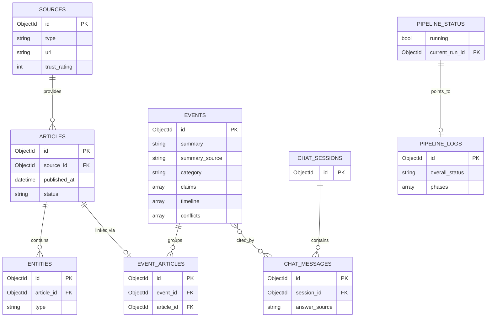

# Database Design Document

## 1. Database Technology
- **Primary store**: MongoDB Atlas (cloud), connected via `MONGODB_URI`.
- **Vector store**: ChromaDB — `article_embeddings`, `event_embeddings` (IDs match Mongo `_id`).
- **No `users` collection** — no auth/roles.

## 2. Entity Overview
`sources`, `articles`, `entities`, `events`, `event_articles`, `chat_sessions`, `chat_messages`, `pipeline_logs`, `pipeline_status` (singleton).

## 3. Collections

### 3.1 `sources`
| Column | Type | Required | Default | Notes |
|---|---|---|---|---|
| _id | ObjectId | yes | auto | |
| name | string | yes | — | |
| type | enum(rss,api,scrape) | yes | — | |
| url | string | yes | — | |
| trust_rating | int 0-100 | yes | 50 | legacy source metadata retained for attribution/config compatibility; not used to compute event credibility |
| active | bool | yes | true | |
| field_mapping | object | no | — | API sources only: maps canonical fields (`title`, `url`, `published_at`, `content`) to the source API's JSON item field names; canonical names are used when omitted |
| link_selector | string | no | — | Scrape sources only: CSS selector for article `<a>` elements on the listing page |
| content_selector | string | no | — | Scrape sources only: CSS selector for the main article body on each linked page |
| created_at | datetime | yes | now | |

Preserved across a "Clean DB" — it's config, not pipeline output.

### 3.2 `articles`
| Column | Type | Required | Default | Notes |
|---|---|---|---|---|
| _id | ObjectId | yes | auto | |
| source_id | ObjectId FK | yes | — | |
| url | string | yes | — | |
| url_hash | string | yes | — | unique |
| title | string | yes | — | |
| raw_text | string | no | — | |
| cleaned_text | string | no | — | |
| published_at | datetime | **yes** | — | required — shown on UI; falls back to ingestion time if source omits it |
| category_hint | enum(ATTACK,GEOPOLITICS,PEACE_DEAL,AGREEMENT,DRILL,OTHER_MILITARY) | no | — | set by topic filter |
| status | enum(ingested,cleaned,filtered_ok,rejected,processed,failed) | yes | ingested | |
| rejection_reason | string | no | — | e.g. `too_short`, `off_topic` |
| created_at | datetime | yes | now | |

### 3.3 `entities`
Unchanged: `article_id` FK, `text`, `type`(PERSON/ORG/LOCATION/MISC), `mention_count`.

### 3.4 `events`
| Column | Type | Required | Default | Notes |
|---|---|---|---|---|
| _id | ObjectId | yes | auto | |
| summary | string | no | — | collective summary across ALL member articles |
| summary_source | enum(qwen_primary,openrouter_secondary,structured_fallback) | no | — | which path produced it |
| category | enum(ATTACK,GEOPOLITICS,PEACE_DEAL,AGREEMENT,DRILL,OTHER_MILITARY) | no | — | |
| claims | array<object> | yes | [] | structured event claims extracted from member articles |
| timeline | array<object> | yes | [] | dated event timeline entries |
| conflicts | array<object> | yes | [] | source disagreements or unresolved conflicting details |
| source_refs | array<object> | yes | [] | source/article attribution used as evidence |
| locations | array<string> | yes | [] | normalized location entities associated with the event |
| hybrid_cluster_metadata | object | yes | {} | clustering method, signal weights, thresholds, and diagnostics |
| article_count | int | yes | 0 | |
| status | enum(clustered,summarized) | yes | clustered | |
| centroid_embedding_id | string | no | — | |
| first_article_at / latest_article_at | datetime | no | — | from member articles' `published_at` |
| created_at / updated_at | datetime | yes | now | |

### 3.5 `event_articles`
Unchanged: `event_id` FK, `article_id` FK, unique pair, `article_id` unique overall.

### 3.6 `chat_sessions` / `chat_messages`
Unchanged, **minus `user_id`** (no users) — a session is just an anonymous conversation thread, identified by a client-generated/browser-stored session id.
`chat_messages` gains: `answer_source` enum(`qwen_primary`,`openrouter_secondary`,`structured_fallback`,`no_match`) on assistant messages.

### 3.7 `pipeline_logs` (NEW)
| Column | Type | Required | Notes |
|---|---|---|---|
| _id | ObjectId | yes | |
| started_at | datetime | yes | |
| completed_at | datetime | no | |
| overall_status | enum(running,completed,failed) | yes | |
| phases | array of objects | yes | one entry per phase, e.g. `{phase:"collect", status:"done", new:12, skipped_dupes:3, source_errors:[]}` |

### 3.8 `pipeline_status` (NEW, singleton — one document)
| Column | Type | Notes |
|---|---|---|
| running | bool | run-lock flag |
| current_run_id | ObjectId | FK → pipeline_logs, null when idle |
| current_phase | string | for live polling display |

## 4. Relationships
- `sources` 1—N `articles`
- `articles` 1—N `entities`
- `events` 1—N `event_articles` N—1 `articles` (article belongs to exactly one event)
- `chat_sessions` 1—N `chat_messages`
- `events` N—N `chat_messages` (via citations)
- `pipeline_logs` referenced by `pipeline_status.current_run_id`

## 5. ER Diagram



## 6. Indexing Strategy
- `articles.url_hash` unique; `articles.status` index; `articles.published_at` index (for date display/sort).
- `event_articles.article_id` unique; `event_articles.event_id` index.
- `events.category`, `events.latest_article_at` compound index.
- Text index on `events.summary`.
- `chat_messages.session_id` index.

## 7. Data Integrity Rules
- No `users` collection exists — no user-scoped ownership checks anywhere.
- "Clean DB" (FR-002) clears all collections **except `sources`**.
- "Run Pipeline" (FR-001) always clears everything first (same as Clean DB) then repopulates — no incremental accumulation across runs.
- `pipeline_status` is a singleton; only one document ever exists; `running=true` blocks a second run from starting.
- `event_articles.article_id` uniqueness still enforced (one article → one event).

## 8. Example Records
```json
// events
{ "_id":"665f1a...", "summary":"Joint naval drills took place in the Baltic Sea this week, involving three NATO members...",
  "summary_source":"qwen_primary", "category":"DRILL", "claims":[{"text":"Multiple reports describe naval drills in the Baltic Sea.","article_ids":["665..."]}],
  "timeline":[{"date":"2026-08-20T10:15:00Z","description":"Latest member report published."}],
  "conflicts":[], "article_count":4, "status":"summarized", "latest_article_at":"2026-08-20T10:15:00Z" }

// pipeline_logs
{ "_id":"665f9a...", "started_at":"2026-08-28T09:00:00Z", "completed_at":"2026-08-28T09:02:14Z",
  "overall_status":"completed",
  "phases":[
    {"phase":"clean_db","status":"done"},
    {"phase":"collect","new":40,"skipped_dupes":6,"source_errors":[]},
    {"phase":"clean","cleaned":38,"rejected_short":2},
    {"phase":"filter","filtered_ok":22,"rejected_offtopic":16},
    {"phase":"embed","processed":22,"failed":0},
    {"phase":"cluster","events_created":7,"singleton_events":3},
    {"phase":"summarize","summarized":7,"fallback_used":1,"failed":0}
  ]}
```
