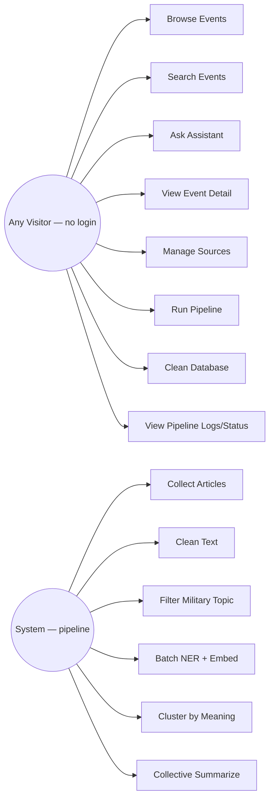
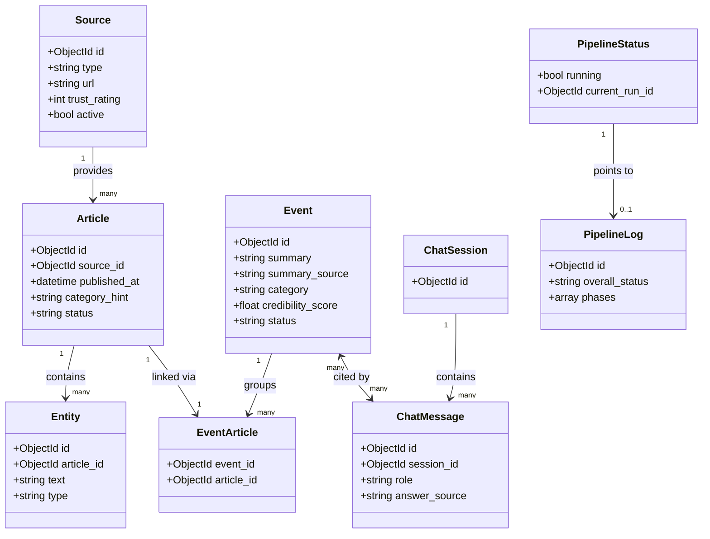
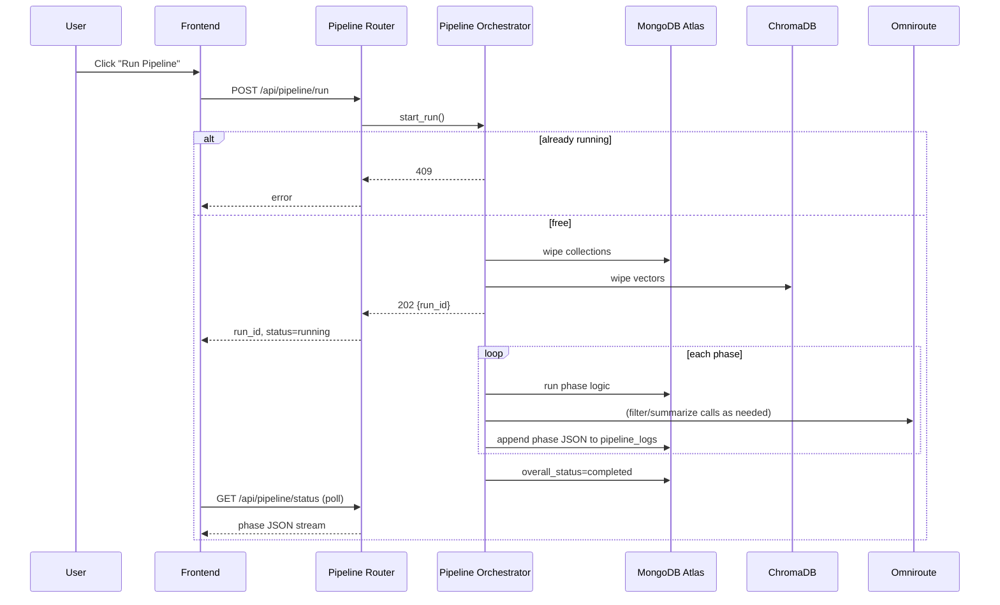
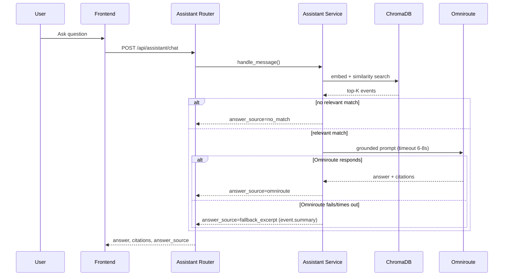
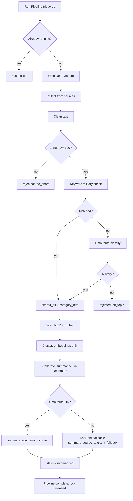
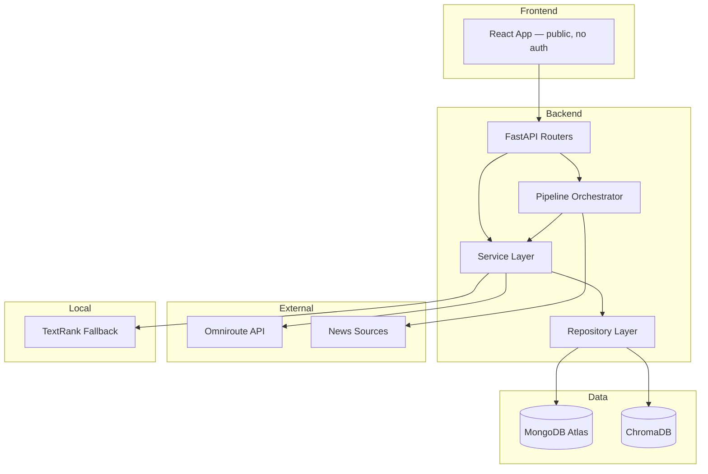

# UML Diagrams Document

## 1. Use Case Diagram

## 2. Class Diagram (Core Domain Model)

## 3. Sequence Diagram — Run Pipeline

## 4. Sequence Diagram — Basic Assistant

## 5. Activity Diagram — Full Pipeline

## 6. Component Diagram

